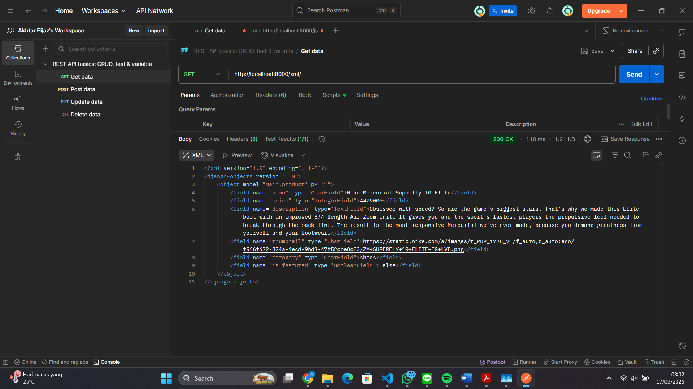

Web : https://akhtar-eijaz-futbolarchive.pbp.cs.ui.ac.id/

<details>
<Summary><b>Tugas 2</b></Summary>

Jelaskan bagaimana cara kamu mengimplementasikan checklist di atas secara step-by-step (bukan hanya sekadar mengikuti tutorial).

Membuat sebuah proyek Django baru : Membuat direktori baru untuk Football Shop, untuk Football Shop saya menamakan dengan nama futbol-archive, lalu masuk ke dalam direktori tersebut lalu buka terminal, buat virtual environment dengan menjalankan perintah python -m venv env, mengaktifkan virtual environment dengan perintah env\Scripts\activate, buat berkas requirements.txt yang isinya adalah dependencies di direktori Football Shop yang telah dibuat, install dependencies dengan cara menjalankan perintah pip install -r requirements.txt, buat proyek Django dengan perintah django-admin startproject futbol_archive .


Membuat aplikasi dengan nama main pada proyek tersebut : Jalankan perintah python manage.py startapp main pada terminal direktori futbol-archive, mendaftarkan aplikasi main ke dalam proyek dengan cara menambahkan 'main' ke elemen terakhir dari INSTALLED_APPS yang berada di settings.py


Melakukan routing pada proyek agar dapat menjalankan aplikasi main, Membuat sebuah fungsi pada views.py untuk dikembalikan ke dalam sebuah template HTML yang menampilkan nama aplikasi serta nama dan kelas kamu, Membuat sebuah routing pada urls.py aplikasi main untuk memetakan fungsi yang telah dibuat pada views.py : Membuat direktori templates di dalam direktori aplikasi main dan membuat main.html di dalam direktori templates, isi main.html dengan

<h1>Futbol Archive</h1>

<h5>Name: </h5>
<p>{{ name }}<p>
<h5>Class: </h5>
<p>{{ class }}</p>

Buka views.py dan diisi dengan

from django.shortcuts import render

def show_main(request):
    context = {
        'name': 'Akhtar Eijaz Putranto',
        'class': 'PBP B'
    }

    return render(request, "main.html", context)

Buat urls.py di direktori main dan diisi dengan

from django.urls import path
from main.views import show_main

app_name = 'main'

urlpatterns = [
    path('', show_main, name='show_main'),
]

Buka urls.py di direktori futbol_archive dan tambahkan "path('', include('main.urls'))" di dalam list urlpatterns


Membuat model pada aplikasi main dengan nama Product : Buka berkas models.py pada direktori aplikasi main, isi berkas tersebut dengan

from django.db import models

class Product(models.Model):
    name = models.CharField()
    price = models.IntegerField()
    description = models.TextField()
    thumbnail = models.URLField()
    category = models.CharField()
    is_featured = models.BooleanField()

Dengan ini sudah terbuat model Product dengan atribut name, price, description, thumbnail, category, dan is_featured


Melakukan deployment ke PWS terhadap aplikasi yang sudah dibuat sehingga nantinya dapat diakses oleh teman-temanmu melalui Internet : Buka terminal di direktori futbol-archive dan jalankan perintah berikut

git remote add pws https://pbp.cs.ui.ac.id/akhtar.eijaz/futbolarchive
git branch -M master
git push pws master

Setelah itu jika status build sudah running, maka website https://akhtar-eijaz-futbolarchive.pbp.cs.ui.ac.id/ sudah bisa diakses


Buatlah bagan yang berisi request client ke web aplikasi berbasis Django beserta responnya dan jelaskan pada bagan tersebut kaitan antara urls.py, views.py, models.py, dan berkas html :


Fungsi urls.py adalah untuk mencocokkan path request ke view tertentu dan menghubungkan URL dari fungsi di views.py. Fungsi views.py adalah untuk menyusun context dan merender template html dan mengambil data dari models.py. Fungsi models.py adalah untuk mendefinisikan tabel yang akan menjadi model data dan menyediakan data ke views.py yang akan dikirimkan ke template html. Fungsi berkas html adalah untuk menampilkan context yang diambil dari views.py kepada user.


Jelaskan peran settings.py dalam proyek Django : settings.py dalam proyek Django adalah file konfigurasi utama di Django yang mengatur database, aplikasi, keamanan, dan bahasa. Bagian-bagian settings.py yang dimodifikasi pada Tugas 2 ini diantara lain :
1. ALLOWED_HOSTS : Ini adalah bagian settings.py berbentuk list yang isinya adalah domain yang bisa mengakses server Django. Disini saya menambahkan "localhost", "127.0.0.1", dan url deployment tugas
2. INSTALLED_APPS : Ini adalah bagian settings.py berbentuk list yang isinya adalah daftar aplikasi yang digunakan. Disini saya menambahkan aplikasi yang dibuat yaitu 'main'
3. DATABASE : Ini adalah bagian settings.py yang mengatur database project. Disini saya menambahkan database yang diberikan, seperti name, user, host, port, password


Bagaimana cara kerja migrasi database di Django : Pertama-tama harus membuat file migrasi terlebih dahulu dengan cara menjalankan perintah python manage.py makemigrations di direktori proyek Django fungsinya adalah untuk membaca semua perubahan yang diubah di models.py lalu jalankan python manage.py migrate fungsinya adalah Django membaca semua file migrasi yang belum dijalankan dan menerapkan skema model yang telah dibuat ke dalam database Django lokal


Menurut Anda, dari semua framework yang ada, mengapa framework Django dijadikan permulaan pembelajaran pengembangan perangkat lunak : Mungkin salah satunya karena Django menggunakan bahasa Python yang dikenal mudah dan sintaksnya mudah dipahami dan Django digunakan oleh beberapa perusahaan besar juga, seperti Instagram, Spotify, YouTube


Apakah ada feedback untuk asisten dosen tutorial 1 yang telah kamu kerjakan sebelumnya : Tidak, tutorial 1 sudah cukup jelas dan mudah dimengerti

</details>

<details>
<Summary><b>Tugas 3</b></Summary>

Jelaskan mengapa kita memerlukan data delivery dalam pengimplementasian sebuah platform?
Kita memerlukan data delivery karena data delivery mempunyai banyak manfaat, diantaranya data delivery mempunyai akses yang cepat dan real time dan data delivery memastikan semua data tidak hilang walaupun ada kendala error dan sebagainya. Tanpa data delivery sebuah platform akan susah berkembang karena data yang dikirim bisa telat, hilang, atau tidak sinkron.

Menurutmu, mana yang lebih baik antara XML dan JSON? Mengapa JSON lebih populer dibandingkan XML?
Menurutku JSON karena kalau menulis XML relatif lebih panjang karena tiap elemen butuh tag pembuka dan penutup, sedangkan JSON dapat ditulis secara ringkas seperti dictionary di Python. JSON lebih populer mungkin karena hampir semua API publik seperti Twitter, Spotify, Maps defaultnya memakai JSON dan JSON dapat langsung dipakai di JavaScript tanpa parsing yang terlalu ribet.

Jelaskan fungsi dari method is_valid() pada form Django dan mengapa kita membutuhkan method tersebut?
Method is_valid() adalah method bawaan dari Django yang biasanya dipakai untuk memvalidasi data input yang dikirim user dan method ini akan memeriksa apakah semua field sudah terisi atau belum dan apakah sesuai tipe datanya masing-masing. Kita membutuhkan method is_valid() karena untuk mencegah input user yang formatnya salah. Method is_valid() juga akan mereturn boolean yang jika return True artinya semua datanya valid tapi ketika return False maka ada data yang tidak valid.

Mengapa kita membutuhkan csrf_token saat membuat form di Django? Apa yang dapat terjadi jika kita tidak menambahkan csrf_token pada form Django? Bagaimana hal tersebut dapat dimanfaatkan oleh penyerang?
csrf_token adalah token keamanan yang dipakai oleh Django untuk melindungi form dari serangan CSRF (Cross-Site Request Forgery). Jika kita tidak menambahkan csrf_token pada form Django maka Django akan menolak request POST dan akan menampilkan error. Hal itu dapat dimanfaatkan oleh penyerang dengan cara memaksa browser korban melakukan aksi atas nama korban tanpa mengetahui password selama korban sedang mengakses website target.

Jelaskan bagaimana cara kamu mengimplementasikan checklist di atas secara step-by-step (bukan hanya sekadar mengikuti tutorial).
Pertama-tama di dalam views.py menambahkan fungsi baru untuk melihat objek dalam format XML, JSON, XML by ID, dan JSON by ID. Membuat routing di urls.py dengan menambah elemen di list urlpatterns dan mengimport fungsi yang telah dibuat sebelumnya. Lalu pada templates menambahkan file html yang bernama create_product.html dan product_detail.html untuk membuat halaman ketika membuat produk baru dan menampilkan detail dari produk. Memodifikasi main.html juga untuk menghubungkan main.html dengan file html lainnya. Aku juga menambahkan list CATEGORY_CHOICES untuk membagi kategori produk yang dijual.

Apakah ada feedback untuk asdos di tutorial 2 yang sudah kalian kerjakan?
Tidak tutorial 2 mudah untuk dipahami

Mengakses keempat URL di poin 2 menggunakan Postman, membuat screenshot dari hasil akses URL pada Postman, dan menambahkannya ke dalam README.md.



</details>

<details>
<Summary><b>Tugas 4</b></Summary>

Apa itu Django AuthenticationForm? Jelaskan juga kelebihan dan kekurangannya.
AuthenticationForm adalah form bawaan Django yang dipakai untuk proses login user. Form ini sudah ada di modul django.contrib.auth.forms.
Secara default, AuthenticationForm menyimpan 2 field, yaitu username dan password.
Kelebihan dari AuthenticationForm adalah sudah terintegrasi dengan sistem autentikasi Django, sehingga memudahkan dalam proses login user dan tidak perlu bikin form login dari nol. Kekurangannya adalah kurang fleksibel karena hanya menyediakan field username dan password saja, sehingga jika ingin menambahkan field lain harus membuat form sendiri.

Apa perbedaan antara autentikasi dan otorisasi? Bagaiamana Django mengimplementasikan kedua konsep tersebut?
Autentikasi adalah proses verifikasi identitas user, apakah user itu valid atau tidak, sedangkan otorisasi adalah memastikan user yang valid dapat melakukan aksi. Django mengimplementasikan autentikasi dengan sistem login dan logout, sedangkan otorisasi diimplementasikan dengan sistem permission dan group.

Apa saja kelebihan dan kekurangan session dan cookies dalam konteks menyimpan state di aplikasi web?
Session = data user disimpan di server (server-side), sementara browser hanya pegang session ID (biasanya di cookie atau URL parameter).
Cookies = data kecil yang disimpan di browser (client-side), dan dikirim ke server pada setiap request HTTP ke domain terkait.
Kelebihan session adalah data disimpan di server, bukan di client dan hanya session ID yang dikirim sehingga lebih aman. Kekurangan session adalah memerlukan storage di server sehingga bisa membebani server jika banyak user. Kelebihan cookies adalah sederhana sehingga data langsung ada di browser dan dapat dipakai lintas domain. Kekurangan cookies adalah data disimpan di client sehingga rentan terhadap serangan dan dapat dilihat atau diedit oleh user.

Apakah penggunaan cookies aman secara default dalam pengembangan web, atau apakah ada risiko potensial yang harus diwaspadai? Bagaimana Django menangani hal tersebut?
Secara default, cookies tidak aman karena bisa diakses dan diedit oleh user. Risiko potensial yang harus diwaspadai antara lain, XSS (Cross-Site Scripting) dan CSRF (Cross-Site Request Forgery). Django menangani hal tersebut dengan menyediakan fitur HttpOnly cookies yang tidak bisa diakses oleh JavaScript, Secure cookies yang hanya dikirim melalui HTTPS, dan CSRF protection untuk melindungi dari serangan CSRF seperti menambahkan csrf_token di form.

Jelaskan bagaimana cara kamu mengimplementasikan checklist di atas secara step-by-step (bukan hanya sekadar mengikuti tutorial).
1. Membuat fungsi dan form untuk login, logout, dan register dengan menggunakan AuthenticationForm dari django.contrib.auth.forms. 
2. Membuat view untuk menangani proses login dan logout user.
3. Membuat routing di urls.py untuk menghubungkan URL dengan view yang telah dibuat.
4. Membuat berkas HTML untuk login dan register.
5. Menambahkan potongan kode @login_required(login_url='/login') pada show_main dan show_product sehingga yang dapat mengakses hanya user yang sudah login.
6. Menggunakan data dari cookies dengan cara menampilkan kapan terakhir user login dengan cara mengubah kode di fungsi login_user seperti,
if form.is_valid():
    user = form.get_user()
    login(request, user)
    response = HttpResponseRedirect(reverse("main:show_main"))
    response.set_cookie('last_login', str(datetime.datetime.now()))
    return response
dan menambahkan kode 'last_login': request.COOKIES['last_login'] pada context di fungsi show_main. Lalu mengubah fungsi logout_user seperti,
def logout_user(request):
    logout(request)
    response = HttpResponseRedirect(reverse('main:login'))
    response.delete_cookie('last_login')
    return response
Fungsi ini untuk menghapus cookie last_login dari daftar cookies.
7. Menghubungkan model Product dengan user agar setiap user hanya dapat melihat produk yang dibuat sendiri dengan menambahkan user = models.ForeignKey(User, on_delete=models.CASCADE, null=True) pada model Product dan buat file migrasi model dengan python manage.py makemigration dan menjalankan migrasi model dengan python manage.py migrate
8. Menjalankan server lokal dan register 2 user lalu membuat 3 produk di masing-masing user.

</details>

<details>
<Summary><b>Tugas 5</b></Summary>

Jika terdapat beberapa CSS selector untuk suatu elemen HTML, jelaskan urutan prioritas pengambilan CSS selector tersebut!
Urutan prioritas pengambilan CSS selector adalah sebagai berikut:
1. Inline styles (menggunakan atribut style di elemen HTML)
2. ID selectors (menggunakan tanda # diikuti dengan ID elemen)
3. Class selectors (menggunakan tanda . diikuti dengan nama class)
4. Attribute selectors (menggunakan tanda [] untuk memilih elemen berdasarkan atribut)
5. Element selectors (menggunakan nama elemen HTML seperti div, p)


Mengapa responsive design menjadi konsep yang penting dalam pengembangan aplikasi web? Berikan contoh aplikasi yang sudah dan belum menerapkan responsive design, serta jelaskan mengapa!
Responsive design adalah pendekatan desain web agar tampilan aplikasi bisa menyesuaikan diri dengan berbagai ukuran layar (HP, tablet, laptop). Beberapa alasan pentingnya, antara lain:
1. Pengalaman pengguna (UX) – pengguna HP tidak harus zoom in/scroll horizontal untuk membaca konten.
2. Aksesibilitas – semua orang bisa mengakses dengan nyaman
3. SEO (Search Engine Optimization) – Google memberi ranking lebih tinggi pada website yang mobile-friendly.
Contoh aplikasi yang sudah menerapkan responsive design: 
1. YouTube - tampilan player, rekomendasi, dan komentar berubah sesuai layar.
2. Tokopedia - grid produk menyesuaikan lebar layar.
Contoh aplikasi yang belum menerapkan responsive design:
1. Situs berita lama - teks terlalu kecil di HP jadi harus zoom manual dan tombol terkadang susah untuk di klik.
2. Situs pemerintah - beberapa masih menggunakan layout tetap yang tidak menyesuaikan layar kecil.


Jelaskan perbedaan antara margin, border, dan padding, serta cara untuk mengimplementasikan ketiga hal tersebut!
1. Margin
- Area di luar border elemen → memberi jarak antara elemen dengan elemen lain.
- Transparan (tidak punya warna).
- Digunakan untuk mengatur spasi antar elemen.
2. Border
- Batas tepi elemen → garis yang membungkus konten dan padding.
- Bisa diatur ketebalan, gaya, dan warnanya.
- Letaknya di antara padding dan margin
3. Padding
- Ruang antara konten dan border elemen.
- Mendorong isi (teks/gambar) ke dalam agar tidak menempel ke border.
- Juga transparan, tapi memengaruhi ukuran elemen.
Cara implementasi :
```css
.box {
    margin: 10px; /* jarak luar 10 pixel di semua sisi */
    border: 2px red; /* garis merah 2 pixel */
    padding: 15px; /* jarak dalam 15 pixel */
}
```

Jelaskan konsep flex box dan grid layout beserta kegunaannya!
1. Flexbox
- Layout satu dimensi (baris atau kolom).
- Mengatur elemen dalam satu baris atau kolom dengan mudah.
Kegunaan: membuat navbar, tombol yang rata, atau daftar item yang fleksibel.
2. Grid Layout
- Layout dua dimensi (baris dan kolom).
- Membagi area menjadi baris dan kolom untuk menempatkan elemen.
Kegunaan: membuat tata letak halaman kompleks seperti dashboard atau galeri gambar.

Jelaskan bagaimana cara kamu mengimplementasikan checklist di atas secara step-by-step (bukan hanya sekadar mengikuti tutorial).
1. Menambahkan fungsi edit_product, delete_product di views.py dan import kedua fungsi tersebut di urls.py dan tambahkan path urlnya.
2. Menambahkan berkas html baru navbar.html untuk menavigasi berbagai halaman atau fitur di webnya.
3. Membuat file CSS baru di dalam direktori static/main dengan nama global.css
4. Menambahkan custom styling ke global.css
5. Menghubungkan global.css ke semua berkas html


</details>

<details>
<Summary><b>Tugas 5</b></Summary>

Apa perbedaan antara synchronous request dan asynchronous request?
Synchronous Request:
- Permintaan (request) dieksekusi secara berurutan.
- Pengguna harus menunggu sampai permintaan selesai sebelum dapat melanjutkan ke tugas lain.
- Proses lainnya akan diblokir selama permintaan sedang diproses.
- Misalnya, saat mengisi form di situs web dan menunggu hingga data diproses sebelum melanjutkan.

Asynchronous Request:
- Permintaan tidak menghalangi alur eksekusi lain.
- Proses dapat berjalan di latar belakang, memungkinkan pengguna untuk terus berinteraksi dengan aplikasi selama data sedang diproses.
- AJAX (Asynchronous JavaScript and XML) adalah salah satu teknik yang memungkinkan pengiriman permintaan secara asynchronous di web.


Bagaimana AJAX bekerja di Django (alur request–response)?
1. User Action: Pengguna melakukan aksi yang memicu permintaan AJAX, misalnya klik tombol.
2. AJAX Request: JavaScript mengirim permintaan AJAX (biasanya menggunakan fetch() atau XMLHttpRequest) ke server.
3. Django View: Django menerima permintaan ini melalui URL yang terkait dengan view tertentu.
4. Proses Data: Django memproses permintaan tersebut (misalnya, mengambil data dari database atau 5. melakukan operasi lainnya).
5. Response: Django mengembalikan response (misalnya, JSON atau HTML) yang akan diproses oleh JavaScript di sisi klien.
6. Update UI: JavaScript menerima response dan memperbarui UI (misalnya, menampilkan data baru tanpa me-refresh halaman).

Apa keuntungan menggunakan AJAX dibandingkan render biasa di Django?
1. Interaksi Lebih Cepat: Dengan AJAX, hanya bagian yang berubah di halaman yang dimuat ulang, bukan seluruh halaman, sehingga meningkatkan kecepatan dan responsivitas.
2. Pengalaman Pengguna (UX) Lebih Baik: Pengguna tidak perlu menunggu halaman untuk dimuat ulang, yang membuat aplikasi terasa lebih cepat dan responsif.
3. Mengurangi Beban Server: Dengan hanya mengirimkan data yang diperlukan, alih-alih mengirimkan seluruh halaman HTML, penggunaan AJAX dapat mengurangi beban pada server.

Bagaimana cara memastikan keamanan saat menggunakan AJAX untuk fitur Login dan Register di Django?
- Gunakan CSRF Token: Django secara otomatis mengelola proteksi CSRF (Cross-Site Request Forgery). Saat mengirim permintaan AJAX untuk login atau registrasi, pastikan untuk menyertakan token CSRF dalam header permintaan. Django memverifikasi token tersebut untuk memastikan bahwa permintaan berasal dari sumber yang sah.
- Gunakan HTTPS: Pastikan komunikasi antara klien dan server aman dengan menggunakan HTTPS, untuk mencegah data seperti password dicuri selama transmisi.
- Validasi Input: Selalu validasi dan sanitasi input yang diterima dari pengguna. Jangan hanya mengandalkan validasi sisi klien, tetapi juga pastikan server-side validation berjalan.

Bagaimana AJAX mempengaruhi pengalaman pengguna (User Experience) pada website?
1. Interaktivitas Lebih Cepat: AJAX memungkinkan pengalaman yang lebih responsif, di mana pengguna dapat berinteraksi dengan aplikasi tanpa menunggu seluruh halaman dimuat ulang.
2. Pengalaman yang Lebih Mulus: Dengan memuat hanya data yang dibutuhkan, pengguna merasakan navigasi yang lebih cepat dan tidak terganggu oleh proses muat ulang halaman.
3. Feedback Instan: AJAX memungkinkan server untuk mengirimkan respons secara instan ke klien, memungkinkan aplikasi untuk memberikan feedback langsung (misalnya, saat mengisi form, pengguna mendapatkan validasi langsung tanpa harus mengirim ulang form).
</details>